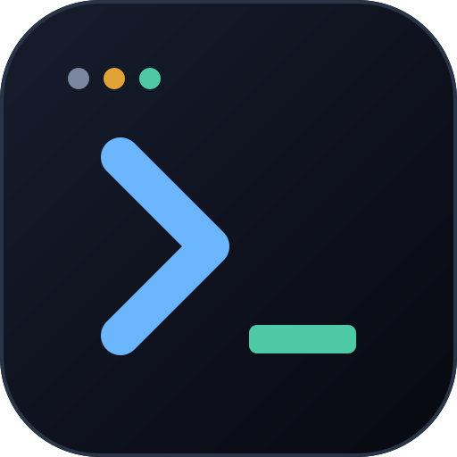
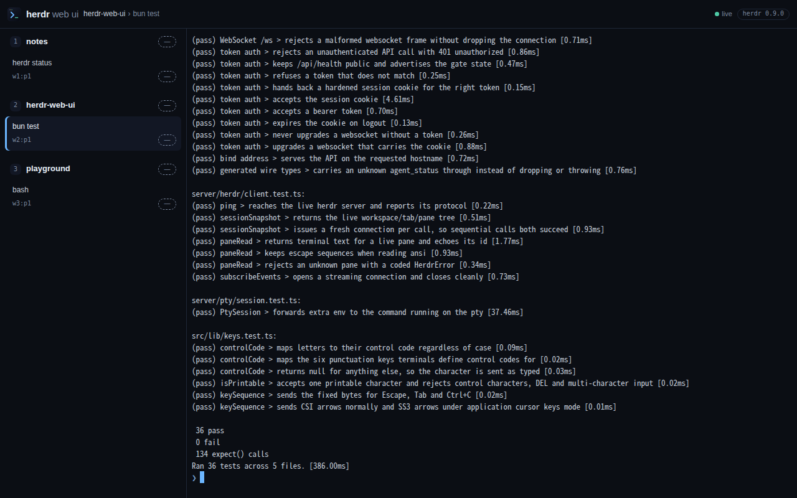
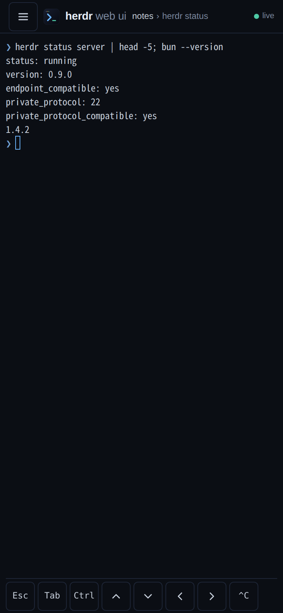

<p align="center">
  
</p>

<h1 align="center">herdr web ui</h1>

<p align="center">Your live herdr workspaces, tabs and panes in a browser tab or on your phone.</p>

<p align="center">
  <a href="LICENSE"></a>
  
  
  
</p>

<table align="center">
  <tr>
    <td align="center"></td>
    <td align="center"></td>
  </tr>
  <tr>
    <td align="center">Desktop</td>
    <td align="center">Phone, key bar visible</td>
  </tr>
</table>

> The screenshots above predate the current redesign.

herdr web ui is a browser UI and installable PWA for [herdr](https://herdr.dev). It shows the workspaces, tabs and panes of a running herdr server, renders real terminal output with xterm.js, and routes your keystrokes back into the live pane. herdr itself is a separate project and is not bundled here.

## Why

herdr already owns the ptys. The architecture borrows from [chatmux](https://github.com/devswha/chatmux), but where chatmux spawns its own ptys with node-pty, this project spawns none of its own: it is a bridge over herdr's newline-delimited JSON unix-socket API plus the real `herdr terminal attach` byte stream.

**The terminal is the attach stream, not a screen poll.** Every pane is a real `herdr terminal attach` on a pty and its raw bytes go to xterm.js, so full-screen agent TUIs, the alternate screen, mouse reporting and herdr's own scrollback all behave. Rebuilding the screen from periodic `pane.read` snapshots is the cheaper design, and it caps at the visible viewport.

**A second device never disturbs the first.** Attaches coexist — the server never passes `--takeover`, so opening a pane in the browser doesn't displace your desktop TUI. The `observe` role goes further and is enforced server-side: an observer's input, keys and resize are refused, and its attach adopts the pty's grid instead of imposing a phone's (`server/index.ts`). The app connects as `interact` and has no toggle for it; the role is part of the WS contract for clients that want a read-only connection.

**It is safe to expose.** A shared-token gate with an HttpOnly cookie guards every private API route and the `/ws` upgrade, and the bind address is yours to choose (see [Security](#security)).

## Features

- Light, dark and system-following themes plus comfortable and compact density. Settings also keep terminal font size, Enter/Mod+Enter behavior and thinking visibility in one sanitized local record (`src/lib/settings.ts`, `src/components/SettingsDialog.tsx`).
- A chat-style sidebar roster with two-line agent rows, inline workspace/pane rename, two-step pane close, and workspace drag or `Alt+↑/↓` reorder (`src/components/Sidebar.tsx`, `POST /api/pane/rename`, `POST /api/workspace/rename`, `POST /api/workspace/move`). Pane search is the command palette's job (`Mod+Shift+K`).
- **New session** chooses a herdr agent, directory and optional label. `POST /api/workspace/create` runs `workspace.create`, then `agent.start` in the root pane when an agent was chosen (`src/components/NewSessionDialog.tsx`, `server/index.ts`).
- A real terminal per pane: `herdr terminal attach` on a PTY, raw bytes streamed to xterm.js over a WebSocket, keystrokes streamed back (`server/index.ts`, `src/components/PaneTerminal.tsx`).
- Scrollback stays in herdr. The attach stream runs in the alternate screen with mouse reporting on, so wheel and touch gestures scroll the real pane, which also works for full-screen agent TUIs.
- One PTY per pane shared by every connected client, with a 256 KB replay tail so a late joiner sees the current screen.
- Resizing the browser refits xterm, which resizes the pty. The `observe` role flips a connection into a read-only one — it can neither type nor resize, enforced server-side, and its grid follows the pty instead of imposing its own (`shared/protocol.ts`, `server/index.ts`, `src/components/PaneTerminal.tsx`). The app always connects as `interact`; the role belongs to the protocol, not to a button.
- Held input across disconnects: the WebSocket reconnects on its own, but input typed while it was down is never auto-sent. It waits as a draft you review and send (or discard) after reconnect (`src/lib/draft.ts`, `src/lib/ws.ts`).
- Agent status for **every** pane is pushed, not just the open one: sidebar chips read READY, RUN, INPUT and DONE, and alerts fire when a pane needs input, finishes or ends (`server/collector.ts`, `src/lib/notifications.ts`).
- Web Push: on HTTPS (and on iPhone, in the home-screen app) the bell subscribes the device, so alerts arrive with the app closed. The server persists subscriptions and confirms a new device with a test push (`server/push.ts`, `src/lib/push.ts`, `public/sw.js`).
- The header carries the selected pane title and workspace/cwd subtitle, the segmented Chat/Terminal lens switch, connection state, palette, notification, theme, settings and lock actions (`src/App.tsx`).
- Chat is a lens over the live terminal, not a second connection. It reads like Codex: your prompts as solid blocks, the agent's answer as plain markdown, and everything it did in between folded into one `Worked for 7s · 1 edit · 2 commands` line whose rows expand to the call's input and output (`src/lib/workBlocks.ts`). Copy as MD/TXT, timestamps, optional folded thinking and a **New messages** pill; unrecognized sessions fall back to ANSI-stripped scrollback (`server/conversation.ts`, `GET /api/pane/conversation`, `src/components/ChatView.tsx`).
- When a blocked Claude, omp or codex TUI shows a supported question, approval or plan menu, the chat lens presents an interactive prompt card parsed from the visible pane screen. Answers go through `POST /api/pane/prompt/answer`, which rechecks the prompt and drives the real menu with herdr `pane.send_keys` semantics (`server/prompt.ts`, `src/components/PromptCard.tsx`).
- The composer has an agent/status line, pane-local drafts, and `/` completion from `GET /api/pane/commands`: built-ins plus `~/.claude/commands` and the pane project's `.claude/commands`. `@` completion searches cwd-relative files through `GET /api/pane/files` (`server/commands.ts`, `server/files.ts`, `src/components/Composer.tsx`).
- Paste, pick or drag-and-drop png/jpeg/gif/webp images into the composer. Preview cards track upload state; successful `POST /api/pane/image` uploads under the pane cwd and insert an editable `@path` mention (≤8 MB each, up to four per action; `server/paste.ts`).
- While an agent is running, **Stop** sends Escape and **Queue** holds the next message. Sending is configurable: Enter with Shift+Enter for a newline, or Mod+Enter (`src/components/Composer.tsx`, `src/components/PaneTerminal.tsx`, `src/lib/settings.ts`).
- `Mod+Shift+K` opens a keyboard-navigable command palette for panes and app actions. The same `Mod+Shift+key` family switches lens/sidebar, creates a session, moves between panes and opens settings (`src/components/CommandPalette.tsx`, `src/lib/shortcuts.ts`).
- Settings exposes appearance, terminal font size, composer behavior, thinking visibility, shortcuts and PWA install state. An **Install app** button also appears in the sidebar when the browser exposes its install prompt (`src/components/SettingsDialog.tsx`, `src/lib/install.ts`).
- Touch key bar on phones: Esc, Tab, a one-shot Ctrl, arrows and `^C` (`src/components/KeyBar.tsx`).
- OSC 52 clipboard bridge (`src/lib/osc52.ts`): wired but dormant on herdr 0.9.x because the attach screen-diff parser consumes OSC 52 before it reaches the browser.
- Installable PWA with a small service worker (`public/manifest.webmanifest`, `public/sw.js`).
- Optional shared-token gate with an HttpOnly cookie (`server/auth.ts`).

## Requirements

- [Bun](https://bun.sh) 1.4 or newer.
- Node 18 or newer. The PTY sidecar `server/pty/pty-host.mjs` runs on Node because Bun 1.4 has no PTY API and node-pty panics inside Bun ([oven-sh/bun#18546](https://github.com/oven-sh/bun/issues/18546)).
- A running herdr 0.9.0 or newer. The default socket is `~/.config/herdr/herdr.sock`; override it with `HERDR_SOCKET`.

## Quick start

```bash
bun install
bun run start
```

`bun run start` builds the client and serves it at http://localhost:7317.

### Install it as a herdr plugin

```bash
herdr plugin install devswha/herdr-web-ui
```

herdr clones the repo, runs the manifest's build commands (`bun install`, `bun run build`) and registers `devswha.herdr-web-ui`. From then on a `[[startup]]` hook brings the bridge up whenever herdr starts, and three actions drive it by hand (`herdr-plugin.toml`, `scripts/plugin.ts`):

```bash
herdr plugin action invoke devswha.herdr-web-ui.start
herdr plugin action invoke devswha.herdr-web-ui.status
herdr plugin action invoke devswha.herdr-web-ui.stop
```

`start` is idempotent: a server already answering on the port is left alone, so the startup hook never fights an instance you launched yourself. herdr's startup hooks are one-shot commands rather than supervised daemons, so the script detaches the server and keeps its pid and log in `HERDR_PLUGIN_STATE_DIR`.

Plugin commands inherit herdr's environment, not your shell's, so the token and any overrides are read from an `env` file in the plugin's config dir (`herdr plugin config-dir devswha.herdr-web-ui`):

```bash
printf 'HERDR_WEB_TOKEN=%s\nHOST=127.0.0.1\n' "$(openssl rand -hex 16)" \
  > "$(herdr plugin config-dir devswha.herdr-web-ui)/env"
```

herdr injects `HERDR_SOCKET_PATH`; the script maps it onto `HERDR_SOCKET`, so a plugin running inside a named session talks to that session's socket.

Other ways to run it:

```bash
bun run server   # API + WebSocket only, on :7317, serving whatever is in dist/
bun run dev      # Vite on :5173, proxying /api and /ws to :7317
```

Environment variables:

| Variable | Default | Effect |
| --- | --- | --- |
| `PORT` | `7317` | Listen port |
| `HOST` | `0.0.0.0` | Bind address |
| `HERDR_SOCKET` | `~/.config/herdr/herdr.sock` | herdr socket for both the RPCs and the attach stream |
| `HERDR_WEB_TOKEN` | unset | Shared token; unset means no auth |
| `HERDR_WEB_STATE_DIR` | `~/.config/herdr-web-ui` | Where the web push VAPID key (`vapid.json`) and device subscriptions (`push-subscriptions.json`) persist, owner-only |
| `HERDR_WEB_PUSH_SUBJECT` | `https://github.com/devswha/herdr-web-ui` | VAPID contact (`mailto:` or `https:` URL) sent to push services |

`HERDR_SOCKET` steers both the JSON RPCs and the `herdr terminal attach` stream (the server passes it to the CLI as `HERDR_SOCKET_PATH`), so pointing it at a named session's socket, `~/.config/herdr/sessions/<name>/herdr.sock`, shows that session.

## Use it from your phone

The app is installable and runs standalone once installed (`public/manifest.webmanifest`). Service workers and installs need a secure context, so a plain `http://<lan-ip>` works as a normal page but can't be installed (`src/pwa.ts`). Serve it over HTTPS.

The recommended setup is to bind to loopback with a token and put a TLS proxy in front. With Tailscale:

```bash
HOST=127.0.0.1 HERDR_WEB_TOKEN=<token> bun run start
tailscale serve --bg --https=443 http://127.0.0.1:7317
```

Any TLS reverse proxy that sets `x-forwarded-proto` works the same way.

Then install it:

- iOS Safari: Share, then Add to Home Screen.
- Android Chrome: menu, then Install app (or Add to Home screen).

What the phone layout does (`src/components/KeyBar.tsx`, `src/lib/viewport.ts`, `src/components/PaneTerminal.tsx`):

- A key bar under the terminal on touch and narrow screens with Esc, Tab, Ctrl, arrows and ^C. Ctrl is one-shot: tap Ctrl, then a letter.
- The layout follows the soft keyboard (`visualViewport` plus `interactive-widget=resizes-content`) so the prompt stays above it.
- A single-finger drag scrolls the pane. The drag is turned into wheel events, which xterm forwards to herdr, so this also scrolls full-screen agent TUIs.
- Safe-area insets are honoured for notches and home bars.

### Alerts with the app closed (Web Push)

Tap the bell once on the phone. Behind the HTTPS setup above the device subscribes to Web Push, and a test notification ("Alerts are on for this device") confirms the whole path. From then on the server sends an alert when a pane's agent becomes blocked or finishes, or its terminal ends, even when the app is closed.

- iPhone needs iOS 16.4 or newer and the home-screen app: Safari tabs have no Web Push. Open the installed app, then tap the bell.
- Android Chrome works from the browser tab or the installed app.
- The server must be running and able to reach the push services (Google, Apple, Mozilla); alerts are end-to-end encrypted to the device.
- A device that is open and visible still gets the notification, without sound.
- Locking the app (header lock button) unsubscribes that device. Revoking notification permission in the browser also works; the server drops the subscription on the push service's next 404/410.
- The VAPID key in `HERDR_WEB_STATE_DIR` is what every subscription is bound to: deleting `vapid.json` makes every device re-subscribe (they do that on their next visit).

The service worker is deliberately small (`public/sw.js`): navigations are network-first with the cached shell as offline fallback, hashed assets and icons are cache-first, and `/api` and `/ws` are never intercepted. It also shows pushed alerts and opens the app on a tapped alert's pane.

## Security

The default bind is `0.0.0.0`. If `HERDR_WEB_TOKEN` is unset on a non-loopback bind, the server prints a WARNING on stderr (`server/index.ts`).

With `HERDR_WEB_TOKEN` set (`server/auth.ts`):

- Every `/api/*` route except `GET /api/health` and `/api/auth`, plus the `/ws` upgrade, requires the token. A push subscription receives pane titles, so subscribing sits behind the gate. Changing the token does not unsubscribe existing devices; lock them or delete `push-subscriptions.json`.
- The static client, `GET /api/health` and `/api/auth` stay public so the login screen can load.
- The browser sends the token once through the token gate (`POST /api/auth`) and gets back an HttpOnly, SameSite=Strict cookie named `herdr_web_token` with a one-year Max-Age. The cookie is marked Secure when the request came over https or through a proxy setting `x-forwarded-proto: https`.
- Scripts can send `Authorization: Bearer <token>` instead.
- The lock button in the header signs out (`DELETE /api/auth`).
- Token comparisons are constant-time.

The token is the whole authorization decision: anyone holding it can type into your terminals. Use TLS, and never expose the port to the public internet without both TLS and a token. `HOST=127.0.0.1` plus an SSH tunnel is the other sound setup.

## How it works

herdr closes the socket after every response, so each RPC opens its own connection (`server/herdr/client.ts`). `events.subscribe` is the one streaming method, and the server holds two long-lived subscriptions: a status collector (`server/collector.ts`) that carries `pane.agent_status_changed` for **every** pane in the session (herdr needs one subscription per pane, but a single connection carries any number of them; the set is reconciled from `session.snapshot` whenever a pane is created or closed), and a lifecycle subscription for `pane.created` / `pane.closed` / `pane.exited`. Status, pane exits and structure changes fan out to every connected browser as `pane-status`, `pane-exited` and `session-changed` WebSocket messages — the 5-second session poll remains only as a backstop.

The terminal is not built on the JSON API. For each attached pane the server runs `herdr terminal attach <terminal_id>` on a PTY inside the Node sidecar (`server/pty/pty-host.mjs`, driven by `server/pty/session.ts`) and forwards the raw bytes to xterm.js over the WebSocket. The attach stream lives in the alternate screen with mouse reporting on, so scrollback is herdr's, and wheel or touch gestures scroll the real pane. xterm keeps no scrollback of its own.

One PTY serves every client watching the same pane. The server keeps a 256 KB replay tail and hands it to a client that joins late. When the browser is resized, xterm is refitted and the pty resized to match — for `interact` connections. An `observe` connection never resizes: it adopts the pty's grid (delivered as `pane-geometry` messages; when the observer creates the attachment, the pty spawns at the pane's own layout grid, not the observer's viewport) so a phone in view-only mode cannot disturb the operator's geometry, and its `input`, `keys` and `resize` frames are answered with a `read_only` error instead of reaching the pty. Terminal input typed while the WebSocket is down is dropped at the socket layer (`src/lib/ws.ts`) and kept as a reviewable draft in the UI — nothing fires unannounced on reconnect.

herdr's wire types are generated from its schema into `shared/herdr-api.generated.ts`, not written by hand:

```bash
bun run generate:types            # regenerate from scripts/herdr-schema.json
bun run generate:types --check    # fail if the committed output is stale
bun run generate:types --refresh  # re-read the schema from `herdr api schema --json`
```

`--check` runs inside the test suite. Run `--refresh` after a herdr upgrade. String enums are widened with `(string & {})` so a value from a newer herdr still decodes.

## Development

```bash
bun run server   # API + WebSocket on :7317
bun run dev      # Vite dev server on :5173 with hot reload, proxying /api and /ws
```

```bash
bun run typecheck
bun run build
```

## Tests

```bash
bun test
```

The suite runs against the live herdr server; there are no mocks. It's read-only apart from the `herdr-web-ui-test` workspaces it creates and deletes. It covers the generator freshness and determinism gate, the HTTP contract, the WS attach stream, roles (an observe connection cannot resize or type, enforced server-side), concurrent attaches to one pane sharing a single pty, a client that detaches or disconnects mid-attach never keeping the pty alive, the status collector's pushed `pane-status` and `pane-exited` for unattached panes, web push (a fake push service decrypts and verifies every push, including the first alert after a server restart), token auth, the bind address, the herdr client, the PTY sidecar's env pass-through (`server/pty/session.test.ts`) and the pure client modules (key bar, draft, notifications, snapshot merge, push subscription). At the time of writing that's 86 tests across 11 files. The server under test keeps its push state in a temp dir, never in `~/.config/herdr-web-ui`.

## API

Defined in `shared/protocol.ts`.

```
GET    /api/health                              -> { ok, herdr: { version, protocol }, auth }
GET    /api/session                             -> { snapshot }
GET    /api/agents                              -> { agents }
GET    /api/pane/read?pane_id=&source=&format=&lines= -> { read }
GET    /api/pane/conversation?pane_id=           -> { source, turns }
POST   /api/pane/input  { pane_id, text }        -> { ok: true }
POST   /api/pane/close  { pane_id }              -> { ok: true }
POST   /api/pane/rename { pane_id, label }       -> { ok: true }
POST   /api/pane/image  { pane_id, content_type, data_base64 } -> { ok: true, path }
GET    /api/pane/commands?pane_id=               -> { commands }
GET    /api/pane/files?pane_id=&q=&limit=        -> { files }
GET    /api/pane/prompt?pane_id=                 -> { prompt }
POST   /api/pane/prompt/answer { pane_id, prompt_id, option_index? | option_indices? | custom_text? }
                                                   -> { ok: true } | 409 prompt_changed
POST   /api/workspace/create { cwd?, label?, agent? } -> { workspace_id, pane_id, agent_started, error? }
POST   /api/workspace/rename { workspace_id, label }  -> { ok: true }
POST   /api/workspace/move { workspace_id, insert_index } -> { ok: true }
POST   /api/workspace/close { workspace_id }     -> { ok: true }
POST   /api/auth        { token }                -> 204 + cookie
DELETE /api/auth                                 -> 204
GET    /api/push                                 -> { public_key }
POST   /api/push/subscribe { subscription }      -> 204
DELETE /api/push/subscribe { endpoint }          -> 204
POST   /api/push/test { endpoint }               -> 204
WS     /ws   client: attach | detach | input | keys | resize | role
             server: snapshot | pty-data | pty-exit | pane-geometry | role-ack
                     | pane-status | pane-exited | session-changed | error
```

Errors are non-2xx responses with `{ error: { code, message } }`.

## Layout

| Path | Role |
| --- | --- |
| `shared/protocol.ts` | The HTTP/WS contract shared by server and client |
| `shared/herdr-api.generated.ts` | herdr wire types, generated from its API schema |
| `shared/notify-policy.ts` | When a pane is worth an alert and what it says, for the tab and for push |
| `scripts/generate-protocol-types.ts` | The generator and its `--check` freshness gate |
| `scripts/herdr-schema.json` | Snapshot of `herdr api schema --json` |
| `herdr-plugin.toml` | Plugin manifest: build commands, the startup hook and the start/stop/status actions |
| `scripts/plugin.ts` | Plugin lifecycle: detached start (idempotent), stop, status |
| `server/index.ts` | Bun.serve HTTP API, WebSocket fan-out, static client |
| `server/collector.ts` | Server-wide agent-status collector: every pane, attached or not |
| `server/auth.ts` | Shared-token gate and cookie handling |
| `server/push.ts` | Web Push: VAPID key, device subscriptions, alert delivery |
| `server/static.ts` | Serves the built client from `dist/` with per-file cache headers |
| `server/herdr/client.ts` | herdr unix-socket client: RPC and event subscriptions |
| `server/pty/` | PTY attach: Node sidecar host and the Bun-side session |
| `src/App.tsx` | Shell, header, drawer and token gate wiring |
| `src/components/PaneTerminal.tsx` | xterm.js view, input routing, touch scrolling |
| `src/components/KeyBar.tsx` | Touch key bar |
| `src/components/Sidebar.tsx` | Workspace/tab/pane tree with agent status badges |
| `src/components/TokenGate.tsx` | Login screen for the token gate |
| `src/lib/ws.ts` | Reconnecting WebSocket client (role replay; input is never queued) |
| `src/lib/draft.ts` | Held-input draft for typing during disconnects |
| `src/lib/notifications.ts` | Tab alerts for status transitions (devices without push) |
| `src/lib/push.ts` | This device's Web Push subscription |
| `src/lib/snapshot.ts` | Pushed-status merge into the session snapshot |
| `src/lib/keys.ts` | Key bar key mappings |
| `src/lib/viewport.ts` | Visual viewport tracking for the soft keyboard |
| `src/pwa.ts` | Service worker registration |
| `public/sw.js`, `public/manifest.webmanifest` | PWA worker and manifest |
| `DESIGN.md` | Design contract; tokens mirrored in `src/styles.css` |

## Licence

MIT, see [LICENSE](LICENSE). Copyright (c) 2026 devswha.

[herdr](https://github.com/herdrdev/herdr) is a separate project under Apache-2.0 and is not bundled here. This project only talks to its socket and runs its CLI. `scripts/herdr-schema.json` is a snapshot of `herdr api schema --json`, kept so the types can be regenerated without a running server.
