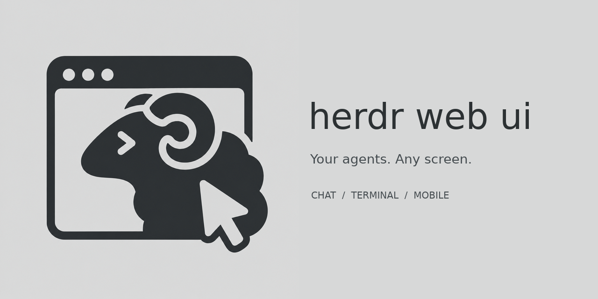

<p align="center">
  
</p>

<h1 align="center">herdr web ui</h1>

<p align="center">Chat with your coding agents. Open the live terminal. Pick up from your phone or another PC.</p>

<p align="center">
  <a href="LICENSE"></a>
  
  
  
</p>

A browser and mobile client for [herdr](https://github.com/herdrdev/herdr). Follow every agent, send prompts, answer approval menus and type into the same terminal from any screen, on this computer or on other PCs reached over SSH.

herdr owns the sessions and terminal processes. This app only adds a web interface, through herdr's socket API and `herdr terminal attach`. The **Chat** and **Terminal** views are two lenses on one live pane.

<p align="center">
  <a href="#get-started">Get started</a> ·
  <a href="#chat-and-terminal">Chat &amp; terminal</a> ·
  <a href="#remote-pcs-over-ssh">Remote PCs</a> ·
  <a href="#use-it-on-your-phone">Mobile</a> ·
  <a href="#updates">Updates</a> ·
  <a href="#configuration">Configuration</a> ·
  <a href="#development">Development</a>
</p>

## Get started

Setting it up with a coding agent? Point it at [INSTALL.md](INSTALL.md), a step-by-step guide written for agents.

You need **Bun 1.4+**, **Node 18+** (it runs the terminal-attach sidecar) and a running **herdr 0.9.0+** with the `herdr` CLI on `PATH`. herdr is a separate project; install it first.

```bash
git clone https://github.com/devswha/herdr-web-ui.git
cd herdr-web-ui
bun install
HOST=127.0.0.1 bun run start
```

Open **http://localhost:7317**. `start` builds the client and launches the server under an update supervisor. It talks to `~/.config/herdr/herdr.sock` unless `HERDR_SOCKET` says otherwise.

### Or install it as a herdr plugin

```bash
herdr plugin install devswha/herdr-web-ui
```

The plugin builds the app and starts it with herdr, bound to `127.0.0.1` and following the socket of the current herdr session. Control it directly with:

```bash
herdr plugin action invoke devswha.herdr-web-ui.start    # leaves a running server alone
herdr plugin action invoke devswha.herdr-web-ui.status
herdr plugin action invoke devswha.herdr-web-ui.stop
```

Its PID and log live under `HERDR_PLUGIN_STATE_DIR`. For persistent settings, add `KEY=value` lines (see [Configuration](#configuration)) to the `env` file in the directory printed by `herdr plugin config-dir devswha.herdr-web-ui`. Protect that file if it holds a token.

## Chat and terminal

| | What you can do |
| --- | --- |
| **Read the conversation** | Prompts and Markdown answers, with the agent's commands, edits and progress folded into one "Worked for …" block per turn. Copy an answer as Markdown or plain text. |
| **See the model** | The model and reasoning effort the session recorded, beside the composer. Thinking summaries are optional. |
| **Drop into the real terminal** | Switch to xterm.js for full-screen TUIs, raw output, keyboard input and herdr's scrollback. |
| **Answer prompts** | Respond to supported approval, question and plan menus from chat. The server checks the menu is still current before answering. |
| **Compose** | `/` commands and `@` file mentions, pasted or dropped images, a draft per pane, and one queued message while the agent works. |
| **Manage sessions** | Start an agent in a directory, rename workspaces and panes, reorder workspaces, and jump anywhere from the command palette. |
| **Follow every agent** | Live status for all panes, and alerts when an agent needs input, finishes or its terminal ends. |
| **Make it yours** | Dark, light or system theme, compact density, terminal and chat font sizes, a resizable composer, Enter behavior and thinking visibility. |

### Where chat comes from

| Agent | Source |
| --- | --- |
| **Codex** | Native rollout JSONL, with tool results and commentary/final phases. Internal context and duplicate records are filtered out. |
| **Claude Code** | Native conversation transcript, resolved through herdr. |
| **omp / omo** | Native session JSONL; omo is recognized by the pane's process tree. |
| **Anything else** | Terminal-text fallback. Use Terminal for the full TUI. |

Structured chat needs the right local session file. Codex resolution checks pane and session evidence instead of picking the newest session in the same directory, and model labels come from recorded metadata, never from answer text. Prompt answering depends on the agent's visible menu format; for an unsupported menu, use Terminal. Details and verification are in the [chat-mode audit](docs/chat-mode-audit.md).

## Remote PCs over SSH

Choose **Add PC** in the sidebar and enter an SSH alias or `user@host` for a Linux or macOS computer. The setup dialog walks through the host fingerprint, password or key passphrase, and an explicit install approval. The sidebar then groups workspaces by PC, and chat, files, images, terminal input and alerts all follow the selected PC.

SSH runs as the web server's account, with its OpenSSH configuration and agent; the browser never opens SSH itself. The remote side gets a private runtime bundle and a loopback-only bridge reached through an SSH forward. A running herdr daemon on that PC is never stopped or replaced.

The server uses bundles built into `remote-bundles/`, or downloads a published release; `HERDR_WEB_BUNDLE_MANIFEST` overrides both. Build a bundle for another platform with `bun run build:remote <linux-x64|linux-arm64|darwin-x64|darwin-arm64>`. See [remote PCs](docs/remote-pcs.md) for the security model, packaging, reconnection and **Update bridge…**.

## Use it on your phone

Serve the app over **HTTPS** to install it and receive Web Push. For example, with Tailscale:

```bash
HOST=127.0.0.1 HERDR_WEB_TOKEN='replace-with-a-long-random-token' bun run start
tailscale serve --bg --https=443 http://127.0.0.1:7317
```

Open the HTTPS address and enter the token. In Safari choose **Share → Add to Home Screen**; in Chrome choose **Install app**. A plain HTTP LAN address still works in the browser, but it cannot install the app or receive push.

On a phone, the terminal gets a key bar (Esc, Tab, Ctrl, arrows, Ctrl+C) that sits above the software keyboard, and dragging the terminal scrolls the real herdr pane.

Tap the bell to turn on alerts for that device. iPhone needs iOS 16.4+ and the home-screen app. Alerts are sent by the running server, so keep it running, and keep `HERDR_WEB_STATE_DIR` across restarts: it holds the push key and device subscriptions.

## Updates

`bun run start` and the plugin run a supervisor that looks for a newer **release** 10 seconds after start and every 5 minutes. A release is a `vX.Y.Z` tag ([CHANGELOG](CHANGELOG.md)); commits on `main` between releases never reach installs. When a release is out, the header names its version; **Settings → Updates** checks on demand and offers **Update and restart**. Set `HERDR_WEB_AUTO_UPDATE=1` to install releases automatically. `bun run server` and `bun run dev` never update.

An update is built and typechecked in a private checkout while the current server keeps serving, then the server restarts and must pass a health check, or the previous build comes back. herdr and its sessions keep running; browsers reconnect briefly, and a **Reload app** notice lets you save drafts before loading the new frontend.

Updates need a clean checkout with an `origin` remote: `main` for a source install, or herdr's own plugin checkout. Local changes, untracked files, another branch or a diverged history block installation, and the updater never resets or overwrites the checkout. An already running server needs one restart on this version to gain the supervisor. Builds and the release pointer live in `HERDR_WEB_STATE_DIR/updates/`. More in [app updates](docs/app-updates.md).

## Configuration

| Variable | Default | Purpose |
| --- | --- | --- |
| `HOST` | `0.0.0.0`; `127.0.0.1` for the plugin | Bind address |
| `PORT` | `7317` | HTTP and WebSocket port |
| `HERDR_SOCKET` | `~/.config/herdr/herdr.sock` | herdr socket for API calls and terminal attach. Use `~/.config/herdr/sessions/<name>/herdr.sock` for a named session. |
| `HERDR_WEB_TOKEN` | unset | Shared token that gates terminal access |
| `HERDR_WEB_STATE_DIR` | `~/.config/herdr-web-ui` | Push keys, device subscriptions, PC registrations and update builds |
| `HERDR_WEB_AUTO_UPDATE` | `0` | `1` installs new releases automatically |
| `HERDR_WEB_PUSH_SUBJECT` | this repository's URL | VAPID contact URL or `mailto:` address |
| `HERDR_WEB_BUNDLE_MANIFEST` | unset | Remote-PC bundle manifest (path or URL) that overrides local and published bundles |
| `HERDR_WEB_HERDR_BIN` | `herdr` | herdr executable used for terminal attach |
| `CODEX_HOME` | `~/.codex` | Where Codex transcripts are read |

### Access and safety

Anyone who can reach an ungated server, or who knows its token, can type into the attached terminals. For remote access, use a token and HTTPS, or bind to loopback and tunnel over SSH.

With a token set, the API and WebSockets require sign-in; only the app shell, health check and sign-in route stay public. Browsers get an HttpOnly, SameSite=Strict cookie, and scripts can send `Authorization: Bearer <token>`. A TLS proxy should send `x-forwarded-proto: https` so the cookie is marked Secure.

Nothing you type is sent behind your back: input typed while disconnected waits as a draft for you to send or discard, and a queued message waits until the agent is ready and sends only to the pane it was written for. Attaches never use `--takeover`, so they coexist with your own herdr TUI; two web servers cannot attach the same pane.

## Keyboard shortcuts

`Mod` is **⌘** on macOS and **Ctrl** elsewhere. Every shortcut adds Shift so the terminal keeps its own Ctrl keys.

| Shortcut | Action |
| --- | --- |
| `Mod+Shift+K` | Command palette |
| `Mod+Shift+J` | Switch Chat / Terminal |
| `Mod+Shift+B` | Toggle sidebar |
| `Mod+Shift+N` | New session |
| `Mod+Shift+↑` / `↓` | Previous / next pane |
| `Mod+Shift+,` | Settings |

Enter sends and Shift+Enter adds a line; Settings can switch sending to Mod+Enter.

## How it works

A React client talks to a Bun HTTP/WebSocket server. The server reads workspace and agent state from herdr's Unix socket and streams the real `herdr terminal attach` output through a Node PTY sidecar. Chat reads the agents' local transcripts, and sending types into the same live pane.

Browsers viewing one pane share one attach. Output has a bounded replay tail and backpressure; a client that stops reading is disconnected instead of buffering without limit ([terminal flow control](docs/terminal-flow-control.md)). herdr owns scrollback.

The service worker caches the app shell and static assets and never touches `/api` or `/ws`. OSC 52 clipboard support is wired, but herdr 0.9.x consumes those sequences before they reach the browser.

## Development

Run the server and Vite side by side:

```bash
bun run server   # API + WebSocket on :7317
bun run dev      # Vite on :5173, proxies /api and /ws
```

Checks:

```bash
bun run typecheck
bun run build
bun test                        # needs a live herdr; creates and removes its own workspaces
bun run test:ui                 # browser regression against isolated test servers
bun scripts/chat-browser-qa.ts  # chat lens end to end
bun run test:ssh                # remote-PC integration over SSH
```

To release, bump `version` in `package.json` and `herdr-plugin.toml`, move the `Unreleased` notes in [CHANGELOG.md](CHANGELOG.md) under the new version, commit, then push `main` together with a `vX.Y.Z` tag (`git push origin main vX.Y.Z`). The release workflow checks that the three versions agree, builds, tests and publishes the GitHub release; installs pick it up within five minutes. Remote-PC runtime bundles are released separately by pushing `remote-vN` after raising `REMOTE_BUNDLE_VERSION` in `shared/machines.ts`.

Browser checks look for Chrome at `/opt/google/chrome/chrome`; set `CHROME_PATH` otherwise. After a herdr upgrade, refresh the generated wire types with `bun run generate:types --refresh` (and `--check` to verify).

| Path | Contents |
| --- | --- |
| [`src/`](src/) | React UI: chat, terminal, composer, sidebar, settings |
| [`server/`](server/) | API, WebSockets, transcript readers, push, PTY bridge, remote PCs and updater |
| [`shared/`](shared/) | HTTP/WebSocket contract and generated herdr types |
| [`scripts/`](scripts/) | Plugin lifecycle, type generation, remote bundles and browser checks |
| [`public/`](public/) | PWA manifest, service worker and icons |
| [`docs/`](docs/) | Remote PCs, updates, flow control, chat audit and brand assets |
| [`DESIGN.md`](DESIGN.md) | Design tokens and UI conventions |

## License

[MIT](LICENSE). Copyright © 2026 devswha.

[herdr](https://github.com/herdrdev/herdr) is a separate Apache-2.0 project. The browser bridge and chat experience take inspiration from [chatmux](https://github.com/devswha/chatmux).
